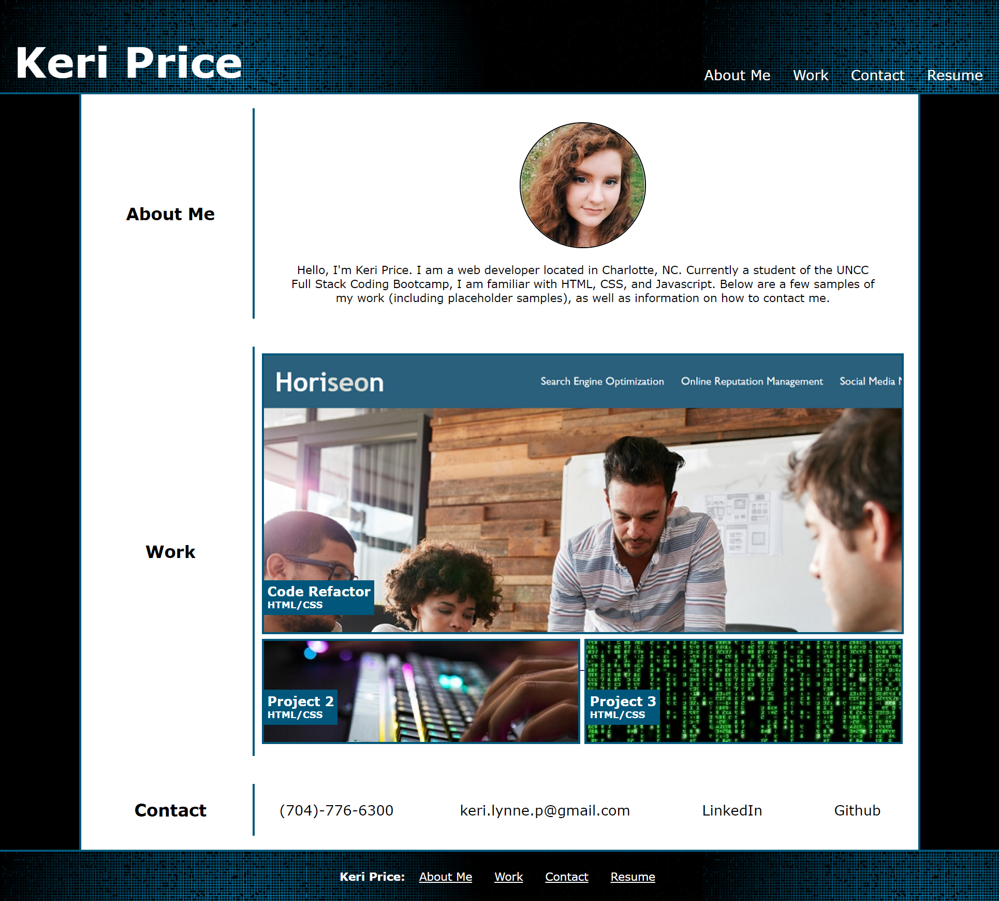

# Professional Portfolio

## Homework 02: Portfolio Assignment

Create a professional portfolio that meets specific guidelines from scratch using HTML and CSS.

## Links

[Live Website] (https://kerilp.github.io/portfolio/)

[Source Code] (https://github.com/kerilp/portfolio)

